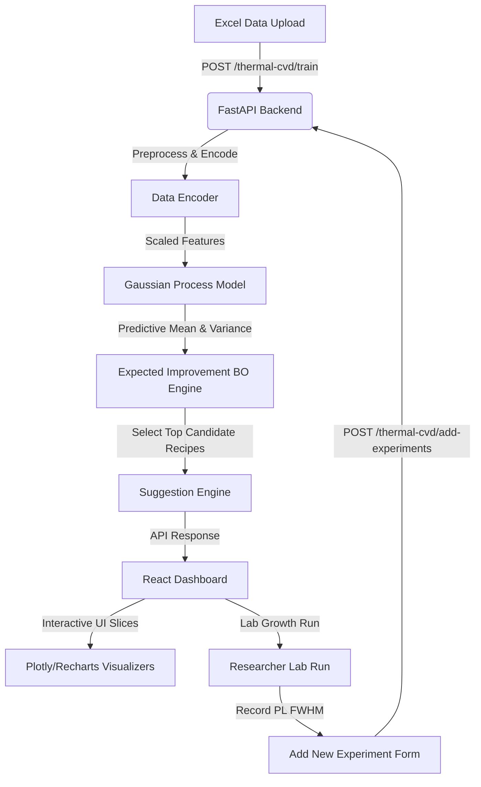

# ⚛️ Quantum Materials AI: Bayesian Optimization for WS₂ CVD

[](https://fastapi.tiangolo.com/)
[](https://reactjs.org/)
[](https://vitejs.dev/)
[](https://tailwindcss.com/)
[](https://www.mongodb.com/)
[](https://scikit-learn.org/)

An advanced machine learning-driven platform designed to accelerate the discovery and synthesis of 2D quantum materials, specifically optimized for **Tungsten Disulfide (WS₂)** grown via **Chemical Vapor Deposition (CVD)**. 

By replacing manual, trial-and-error recipe tuning with **Bayesian Optimization (BO)**, this application guides researchers to the optimal synthesis conditions needed to achieve maximum crystal quality—minimizing photoluminescence Full-Width at Half-Maximum (**PL FWHM**).

---

## 📖 Table of Contents
1. [Overview & Scientific Rationale](#-overview--scientific-rationale)
2. [Key Features](#-key-features)
3. [System Architecture](#-system-architecture)
4. [Mathematical Formulation](#-mathematical-formulation)
5. [Folder Structure](#-folder-structure)
6. [Technology Stack](#-technology-stack)
7. [Active Learning Workflow](#-active-learning-workflow)
8. [API Documentation](#-api-documentation)
9. [Installation & Setup](#-installation--setup)
10. [Verification & Testing](#-verification--testing)

---

## 🔬 Overview & Scientific Rationale

In the synthesis of 2D transition metal dichalcogenides (TMDs) like WS₂:
* **The Problem:** The parameter space of Chemical Vapor Deposition (CVD) is massive and highly non-linear, involving temperature profiles, precursor types, gas flow rates, and chamber pressures. Optimizing these recipes manually is slow, expensive, and resource-intensive.
* **The Solution:** We train a **Gaussian Process (GP)** surrogate model on historical experiment logs. The GP models the relationship between synthesis inputs (8 categorical constants, 4 continuous variables) and the crystal quality.
* **The Metric:** We target **PL FWHM** (meV) as our optimization objective. Lower values indicate fewer structural defects, higher crystallinity, and superior electronic/optical quality.
* **The Acquisition Engine:** We use **Expected Improvement (EI)** as our acquisition function. It balances *exploitation* (exploring regions with predicted high quality) and *exploration* (exploring regions with high model uncertainty) to suggest the next best 5 experimental recipes.

---

## ✨ Key Features

* **Drag-and-Drop Excel Ingestion:** Instant upload and preprocessing of CVD experimental datasets (validated against mandatory columns).
* **Automated Categorical Encoding:** Handles mapping of categorical configurations (Precursors, Substrates, Carrier Gas, etc.) to numerical representation.
* **Gaussian Process Surrogate Model:** A robust GP using a Matérn 5/2 kernel with automatic scaling and noise adjustment to predict performance and uncertainty bounds.
* **Interactive 1D Slices & GP Visualizations:** Plots predicted mean and $\pm 2\sigma$ confidence bands alongside actual observations for GTE, GTI, FRA, and Pressure.
* **Expected Improvement Acquisition Plotter:** Shaded acquisition landscapes showing peak locations representing proposed experimental targets.
* **Smart Suggestion Engine:** Highlights the top 5 predicted recipe configurations ranked by Expected Improvement with normalized progress bars.
* **Active Learning Loop Tracker:** Tracks historical convergence showing how PL FWHM decreases and model confidence grows over iterations.
* **Excel Data Exporter:** One-click download of all data sheets, encoding maps, next suggestions, and convergence history.

---

## 🏗️ System Architecture

The application is split into a lightweight **FastAPI backend** handling ML orchestration and MongoDB integrations, and a reactive **React frontend** built on Vite and Tailwind CSS.

### System Diagram



---

## 🧮 Mathematical Formulation

**Expected Improvement:**

$$ EI(x) = \mathbb{E}[\max(f_{best} - f(x), 0)] $$

**Gaussian Process:**

$$ f(x) \sim \mathcal{GP}(m(x), k(x, x')) $$

**Short Explanation:**
The Gaussian Process (GP) acts as a surrogate model to predict the synthesis quality (PL FWHM) across the parameter space, providing both a predictive mean $m(x)$ and an uncertainty (covariance) measure $k(x, x')$. The Expected Improvement (EI) acquisition function leverages these GP predictions to evaluate candidate experiments. It mathematically balances *exploitation* (evaluating regions where the predicted value is lower than our current best $f_{best}$) and *exploration* (evaluating regions of high uncertainty), systematically guiding the discovery of optimal CVD growth recipes.

---

## 📁 Folder Structure

```
quantum-materials-ai/
├── backend/
│   ├── app/
│   │   ├── acquisition_functions/     # BO Acquisition Functions
│   │   │   ├── expected_improvement.py
│   │   │   └── upper_confidence_bound.py
│   │   ├── database/                  # MongoDB and Configurations
│   │   │   ├── database_manager.py
│   │   │   ├── firebase_config.py
│   │   │   ├── mongodb_config.py      # Async Motor client config
│   │   │   ├── mongodb_models.py      # User and application models
│   │   │   └── thermal_cvd_models.py  # CVD schemas and dataclasses
│   │   ├── ml_models/                 # Machine Learning Models
│   │   │   ├── gaussian_process/
│   │   │   │   └── gp_model.py
│   │   │   └── thermal_cvd/           # CVD Specific GP and BO logic
│   │   │       ├── __init__.py
│   │   │       ├── bayesian_optimization.py
│   │   │       ├── data_encoder.py    # Standard scaling & label encoding
│   │   │       ├── gp_model.py
│   │   │       └── optimizer.py       # End-to-end CVD BO Orchestrator
│   │   ├── preprocessing/             # Preprocessing & Data cleaning
│   │   │   ├── clean_data.py
│   │   │   ├── normalization.py
│   │   │   └── one_hot_encoding.py
│   │   └── routes/                    # API Endpoints (FastAPI Routers)
│   │       ├── dataset_routes.py      # Datasets upload and listing
│   │       ├── experiment_routes.py
│   │       ├── optimization_routes.py
│   │       ├── prediction_routes.py
│   │       ├── thermal_cvd_routes.py  # Thermal CVD BO core endpoints
│   │       ├── upload_routes.py
│   │       └── user_routes.py         # Login, signup, user settings
│   ├── requirements.txt               # Backend dependencies
│   ├── server.py                      # FastAPI App Entrypoint
│   ├── verify_bo_alignment.py         # Alignment validation tests
│   └── verify_setup.py                # Environment verification script
│
├── frontend/
│   ├── public/                        # Static assets (images, templates)
│   ├── src/                           # React Application
│   │   ├── assets/
│   │   ├── components/                # Global UI components
│   │   │   ├── Navbar/
│   │   │   │   └── index.jsx
│   │   │   └── Sidebar/
│   │   │       └── index.jsx
│   │   ├── pages/                     # Routed pages
│   │   │   ├── Dashboard/             # Main metrics, summary, actions
│   │   │   ├── Datasets/              # Dataset manager
│   │   │   ├── Experiments/           # Historical runs and form logs
│   │   │   ├── Home/                  # Project lander
│   │   │   ├── Login/                 # Authentication Pages
│   │   │   ├── Models/                # Model parameter configurations
│   │   │   ├── Optimization/          # Active Learning loop tracker
│   │   │   ├── Results/               # Output visualization page
│   │   │   ├── Settings/              # User preferences
│   │   │   ├── Signup/                # New account generation
│   │   │   ├── Upload/                # Dataset Upload center
│   │   │   ├── Variables/             # Variable range editor
│   │   │   └── VerifyEmail/           # Email validation handler
│   │   ├── services/                  # Backend API clients
│   │   │   ├── api.js                 # Axios API configurations
│   │   │   └── firebase.js
│   │   ├── styles/                    # Global TailwindCSS Styles
│   │   │   └── index.css
│   │   ├── App.jsx                    # Routing & App Layout wrapper
│   │   └── main.jsx                   # React bootloader
│   ├── package.json                   # Frontend dependencies
│   ├── tailwind.config.js             # Styling configuration
│   └── vite.config.js                 # Vite bundler parameters
│
├── FRONTEND_INTEGRATION_GUIDE.md      # API contracts & frontend schema
├── IMPLEMENTATION_CHECKLIST.md         # Active development tracker
└── README.md                          # Project Documentation
```

---

## 🛠️ Technology Stack

| Component | Technology | Description |
|---|---|---|
| **Backend Framework** | [FastAPI](https://fastapi.tiangolo.com/) | High-performance Python async web server with OpenAPI support. |
| **Database** | [MongoDB](https://www.mongodb.com/) / [Motor](https://motor.readthedocs.io/) | NoSQL database with async drivers for user, dataset, and run persistence. |
| **Machine Learning** | [scikit-learn](https://scikit-learn.org/) | Gaussian Process Regression model and data preprocessing scaling. |
| **Mathematical Comp.** | [numpy](https://numpy.org/) / [scipy](https://scipy.org/) | Matrix computations and acquisition function optimization (L-BFGS-B). |
| **Data Manipulation** | [pandas](https://pandas.pydata.org/) | Ingestion, processing, cleaning, and exporting of experimental data sheets. |
| **Frontend Library** | [React.js](https://reactjs.org/) (Vite) | Lightning-fast component library bundled via Vite. |
| **Styling** | [TailwindCSS](https://tailwindcss.com/) | Utility-first responsive CSS styling framework. |

---

## 🔄 Active Learning Workflow

The platform operates on a closed-loop **Active Learning / Bayesian Optimization** flow:

1. **Upload Dataset:** The researcher uploads an Excel file (`.xlsx`) containing at least 5 baseline growth experiments with columns: `GTE`, `GTI`, `FRA`, `Pressure`, and `PL FWHM`.
2. **Model Training:** FastAPI backend encodes the categorical constants and trains a **Gaussian Process (GP)** surrogate model to map the input parameters to `PL FWHM`.
3. **Optimizing Search Space:** The backend generates 5,000 randomized candidates inside the bounded search space:
   * **Growth Temperature Exterior (GTE):** 500°C to 1100°C
   * **Growth Time Interior (GTI):** 5 to 60 minutes
   * **Ar Flow Rate (FRA):** 0 to 600 sccm
   * **Chamber Pressure:** 1 to 760 Torr
4. **Acquisition Function (Expected Improvement):** The GP computes the predicted mean and standard deviation for all candidate points. Expected Improvement (EI) evaluates which point offers the best potential reduction in PL FWHM.
5. **Lab Suggestion:** The top 5 recommendations with the highest EI are displayed to the researcher.
6. **Iteration:** The researcher runs the recommended experiment in the CVD furnace, enters the resulting PL FWHM, and uploads it to retrain the GP model, updating the surrogate landscape.

---

## 🔌 API Documentation

| Method | Endpoint | Description |
|---|---|---|
| `POST` | `/thermal-cvd/train` | Upload Excel database, execute label-encoding and fit StandardScalers. |
| `POST` | `/thermal-cvd/generate-search-space` | Create candidate points grid inside variable bounds (default: 5,000 points). |
| `POST` | `/thermal-cvd/fit-gp` | Fit/update Gaussian Process Regression model. |
| `GET` | `/thermal-cvd/gp-slice` | Fetch 1D surrogate slices (mean + variance) for interactive visualization. |
| `GET` | `/thermal-cvd/acquisition` | Fetch 1D acquisition function (EI) curves per variable. |
| `POST` | `/thermal-cvd/suggest` | Calculate and retrieve top N recommended synthesis recipes. |
| `POST` | `/thermal-cvd/predict` | Predict expected PL FWHM + uncertainty for user-defined variables. |
| `POST` | `/thermal-cvd/add-experiments` | Append new experiment rows to the training set and auto-retrain the GP model. |
| `POST` | `/thermal-cvd/update-constant` | Update fixed categorical constants (e.g., changing substrate or precursors). |
| `GET` | `/thermal-cvd/export` | Download a complete Excel log of runs, suggestions, and convergence stats. |
| `GET` | `/thermal-cvd/encoding-info` | Fetch raw encoding mapping parameters and active bounds. |

---

## 🚀 Installation & Setup

### Prerequisites
* **Python 3.10+**
* **Node.js 18+**
* **MongoDB** (running locally on port `27017` or via MongoDB Atlas connection string)

### 1. Clone & Environment setup
```bash
git clone https://github.com/Khushboo-3107djjk/quantum-materials-ai.git
cd quantum-materials-ai
```

### 2. Backend Setup
Create a Python virtual environment, activate it, and install all required libraries:
```bash
# Create and activate environment
python -m venv .venv
source .venv/bin/activate  # On Windows: .venv\Scripts\activate

# Install requirements
cd backend
pip install -r requirements.txt
```

Create a `.env` file in the `backend/` directory:
```env
MONGODB_URL=mongodb://localhost:27017
DATABASE_NAME=bo_loop_db
```

Start the FastAPI application server:
```bash
python server.py
# Server will run on: http://localhost:8000
# OpenAPI Swagger UI available at: http://localhost:8000/docs
```

### 3. Frontend Setup
Open a new terminal window:
```bash
cd frontend
npm install
npm run dev
# App will run on: http://localhost:5173
```

---

## 🧪 Verification & Testing

To verify the mathematical alignment of the backend's Gaussian Process model and Expected Improvement calculation against the original Google Colab reference notebook, run the alignment verification script:

```bash
cd backend
python verify_bo_alignment.py
```

The script runs 6 automated test scenarios, asserting that:
1. Data encoder maps categoricals precisely.
2. Imputer fills missing variables with matching statistics.
3. Feature matrix order is correctly set as `[cat_enc × 8, vars × 4]`.
4. GP mean predictions align within tolerance.
5. GP standard deviations match the reference predictions.
6. Expected Improvement calculations return identical candidate choices.
